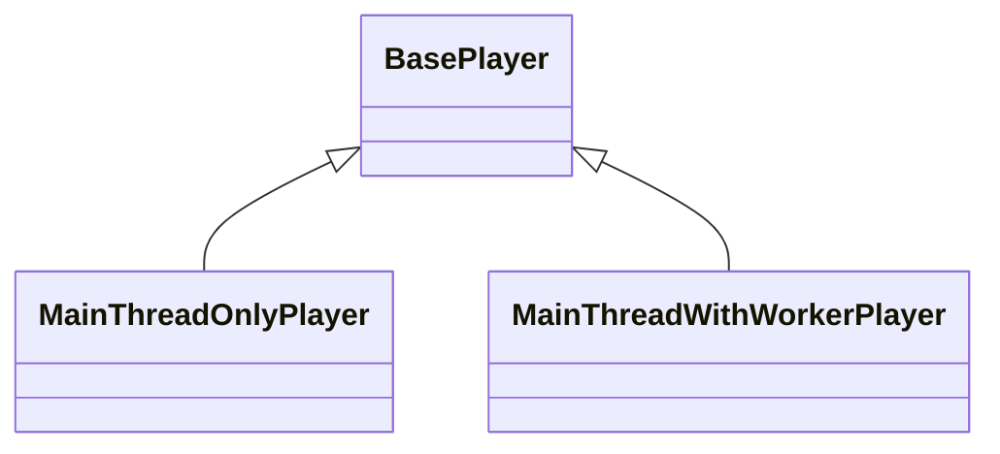

# Walkthrough

## Folder Structure

There are 2 main folders in the `playback` package:

##### `src/entry-points`

> [!Note]
>
> Do not include implementations in this folder. Only re-export public API from `lib` folder.

  - We re-export only public API here
  - We use files from this folder to produce final bundles:
    - Debug: cjs/es/iife
    - Production: cjs/es/iife
    - Types
    - generated API Reference

##### `src/lib`
  - We put only implementations files here

## Player

The main entry point is the base `Player` class: `src/lib/player/base/base-player.ts`

There are 2 classes that extend the base `Player` class:

Both subclasses are intended to be used on the main thread.

`MainThreadOnlyPlayer`: `lib/src/player/main-thread-only/main-thread-only-player.ts` does not have web worker and run fully on main thread.

> [!Note]
>
> `MainThreadOnlyPlayer` is a public API and should be re-exported in the `src/entry-points/main-thread-only-player`.

`MainThreadWithWorkerPlayer`: `lib/src/player/main-thread-with-worker/main-thread-with-worker-player.ts` creates WebWorker and delegates most of the work to the worker thread, except work that is required to be executed on main thread (eg: EME, MSE is not available on worker thread, etc...).

> [!Note]
>
> `MainThreadWithWorkerPlayer` is a public API and should be re-exported in the `src/entry-points/main-thread-with-worker-player`.
>
> This bundle is also listed as a main entry-point for the package in the `package.json` file.
