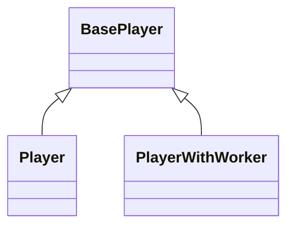

# Walkthrough

<!-- TOC -->
* [Walkthrough](#walkthrough)
  * [Folder Structure](#folder-structure)
    * [`src/entry-points`](#srcentry-points)
    * [`src/lib`](#srclib)
  * [Player](#player)
  * [Worker-Main Thread Communication](#worker-main-thread-communication)
      * [Pipelines](#pipelines)
<!-- TOC -->

## Folder Structure

There are 2 main folders in the `playback` package:

### `src/entry-points`

> [!Note]
>
> Do not include implementations in this folder. Only re-export public APIs from `lib` folder.

  - We re-export only public API here
  - We use files from this folder to produce final bundles:
    - Debug: cjs/es/iife
    - Production: cjs/es/iife
    - Types
    - generated API Reference

### `src/lib`
  - We put only implementations files here

## Player

The main entry point is the base `Player` class: `src/lib/player/base/base-player.ts`

There are 2 classes that extend the base `Player` class:

Both subclasses are intended to be used on the main thread.

`Player`: `src/lib/player/player.ts` does not have web worker and run fully on main thread.

> [!Note]
>
> `Player` is a public API and should be re-exported in the `src/entry-points/player.ts`.

`PlayerWithWorker`: `src/lib/player/player-with-worker.ts` creates WebWorker and delegates most of the work to the worker thread, except work that is required to be executed on main thread (eg: EME, MSE is not available on worker thread, etc...).

> [!Note]
>
> `PlayerWithWorker` is a public API and should be re-exported in the `src/entry-points/player-with-worker.ts`.
>
> This bundle is also listed as a main entry-point for the package in the `package.json` file.

The WebWorker script is available at `src/lib/worker/worker-script.ts` and this is the main entry point for all worker thread processes.

## Worker-Main Thread Communication

There are 2 classes that abstract the communication between the worker and the main thread:

- `MainToWorkerThreadMessageChannel`: `src/lib/player/worker/messages/main-to-worker-thread-messages.ts`
- `WorkerToMainThreadMessageChannel`: `src/lib/player/worker/messages/worker-to-main-thread-messages.ts`

#### Pipelines

// TODO: add pipelines section
